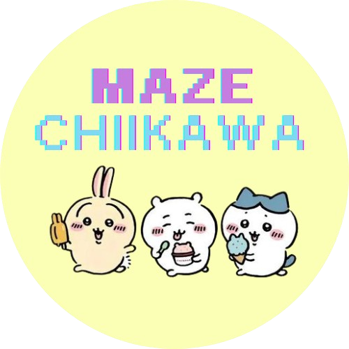

    
    <h1>Maze-Chikawa Game</h1>
    
Trò chơi nhặt kho báu trong mê cung bằng các thuật toán tìm kiếm AI

---

## Nhóm 11
| STT | Họ và tên                   | MSSV       |
|-----|-----------------------------|------------|
| 1   | Nguyễn Thái Bình            | 23110080   |
| 2   | Trương Hoài Chương          | 23110081   |
| 3   | Phạm Thị Kim Ngân           | 23110128   |
---

# BÁO CÁO DỰ ÁN
## 1. Mục tiêu
Dự án Maze-Chikawa Game nhằm mục tiêu xây dựng