

    
    <h1>Maze-Chikawa Game</h1>
    
Trò chơi nhặt kho báu trong mê cung bằng các thuật toán tìm kiếm AI

---

## Nhóm 11
| STT | Họ và tên                   | MSSV       |
|-----|-----------------------------|------------|
| 1   | Nguyễn Thái Bình            | 23110080   |
| 2   | Trương Hoài Chương          | 23110081   |
| 3   | Phạm Thị Kim Ngân           | 23110128   |
---

# BÁO CÁO DỰ ÁN Maze-Chikawa Game
## 1. Mục tiêu
Dự án Maze-Chikawa Game nhằm mục tiêu xây dựng trò chơi nhặt kho báu và giải đố trong mê cung, tích hợp khả năng tìm kiếm đường đi thu thập kho báu và thành công đi đến điểm đích bằng các thuật toán tìm kiếm AI. Xây dựng giao diện trực quan hỗ trợ minh họa quá trình tìm lời giải của thuật toán.

## 2. Nội dung

### 2.1. Nhóm thuật toán tìm kiếm không có thông tin
#### a) Breadth-First Search (BFS)
- **Mô tả**: Trong mê cung, `BFS` bắt đầu mở rộng từ trạng thái ban đầu sang 4 hướng có thể đi được xung quanh, sau đó thêm vào hàng đợi để chờ được mở rộng. Sau đó `BFS` lại lấy ra một trạng thái trong queue theo nguyên tắc `fist in fist out (FIFO)` để tiếp tục mở rộng theo 4 hướng, lặp lại cho đến khi nhặt được toàn bộ kho báu và tìm thấy lối ra. Cách mở rộng này giống với việc người chơi đổ thật nhiều nước vào mê cung, dòng nước sẽ từ từ tràn ra lấp đầy mê cung cho đến khi bao phủ hoàn toàn nó.
- **Minh họa**:

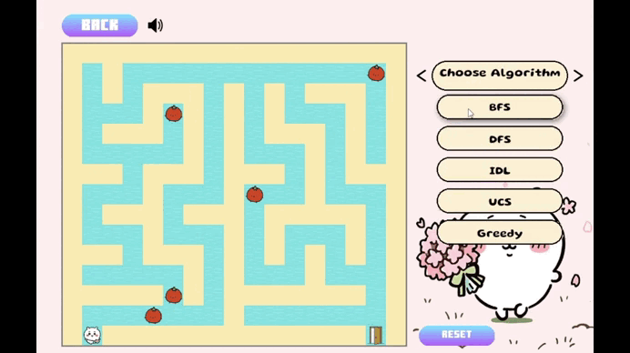

#### b) Depth-First Search (DFS)
- **Mô tả**: 
    - Áp dụng thuật toán DFS vào bài toán mê cung ta có: nhân vật `A` tìm đường đi trong mê cung để thu thập toàn bộ kho báu `t`, và sau đó đến đích `B` nhanh nhất. 
    - **Ý tưởng:**
        - Bắt đầu từ một ô được cài đặc sẵn, nhân vật `A` chọn một hướng đi ngẫu nhiên(trên, dưới, trái, phải).
        - Đi sâu nhất có thể cho đến khi gặp tường `*` hoặc không còn có thể mở rộng nữa thì sẽ quay lui để tìm đường khác.
        - Các trạng thái của bài toán được lưu bởi công thức: (vị trí hiện tại, đường đi đã đi qua, mask kho báu đã nhặt). Khi tất cả kho báo được nhặt `mask == ALL_MASK` và nhân vật `A` đã đến được vị trí `B` (về đích) thì thuật toán kết thúc.
- **Minh họa**:

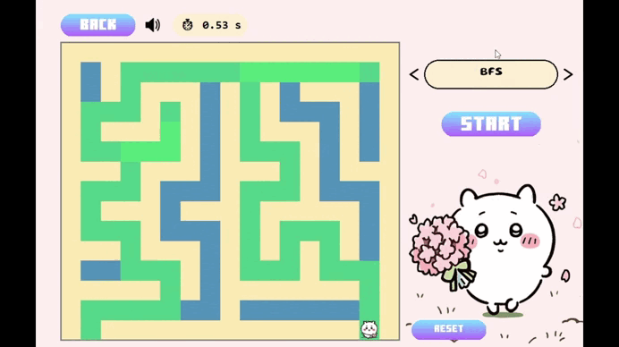

#### c) Iterative Deepening Limited Search (IDL)
- **Mô tả**: 
    - Trong bài toán tìm đường đi trong mê cung có nhiều kho báu, thuật toán `IDL` được sử dụng để lần lượt tìm đường từ vị trí hiện tại đến từng kho báu, và sau cùng là đến đích. Thay vì mở rộng toàn bộ không gian mê cung (như `BFS`), `IDL` thực hiện quá trình tìm kiếm theo chiều sâu có giới hạn, tăng dần mức độ sâu qua từng vòng lặp, đảm bảo khả năng tìm được lời giải ngắn nhất mà vẫn tiết kiệm bộ nhớ.
    - Thuật toán đặc biệt phù hợp trong những mê cung lớn, khi không gian tìm kiếm rất rộng và không thể lưu toàn bộ vào bộ nhớ cùng lúc. Mỗi khi cần di chuyển từ vị trí hiện tại đến một kho báu hoặc đến điểm kết thúc, `IDL` được gọi để xác định đường đi khả thi ngắn nhất trong phạm vi giới hạn độ sâu đã cho.

- **Minh họa**:

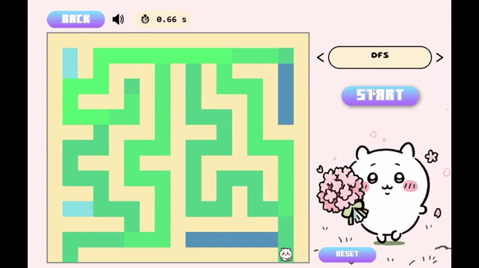

#### d) Uniform-Cost Search (UCS)
- **Mô tả**: 
    - Áp dụng thuật toán `UCS` vào bài toán mê cung, nó sẽ tìm đường đi ngắn nhất từ điểm bắt đầu `A` đến đích `B` dựa trên chi phí, kết hợp nhặt tất cae kho báu `t`.
    - Mỗi trạng thái được lưu thành (vị trí hiện tại, đường đi, mask).
    - Công thức hàm tính chi phí: `g(n) = tổng số bước từ A đến n`.

- **Minh họa**:
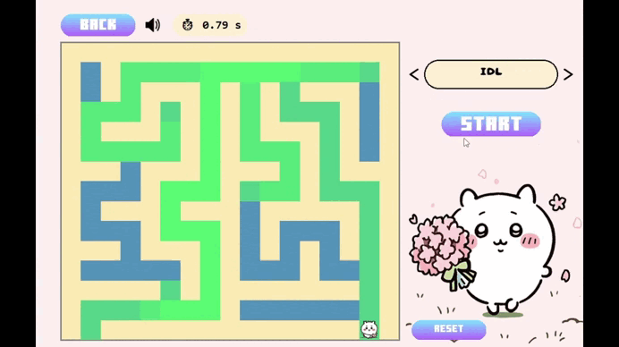

### 2.2. Nhóm thuật toán tìm kiếm có thông tin
#### a) Greedy Best-First Search
- **Mô tả**: 
    - Trong mê cung, `greedy` duyệt qua các hướng cũng gần giống với `BFS`, nhưng thay vì dùng hàng đợi (`queue`) thì `greedy` sử dụng hàng đợi ưu tiên (`priority queue`). Ý tưởng chính để chọn trạng thái sinh ra là từ `priorỉty queue` lấy ra hàng đợi có `h(n)` nhỏ nhất để duyệt, từ đó thể hiện rõ được bản tính `“tham lam”` của thuật toán.
    - Trong bài toán này, yêu cầu đặt ra là nhặt hết toàn bộ kho báu và thoát khỏi mê cung, greedy không thể mở rộng như “dòng nước chảy” giống BFS được. Ý tưởng khám phá mê cung là từ trạng thái ban đầu, nhắm đến kho báu mà có `h(n)` nhỏ nhất để duyệt, như vậy thuật toán sẽ được chia ra thành nhiều lần greedy để nhắm đến từng kho báu, cho đến khi nhặt được hết kho báu thì mới tiến hành tìm đường “tham lam” về đích.
- **Minh họa**:

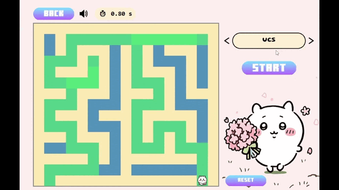

#### b) A* Search Algorithm
- **Mô tả**: Phương pháp áp dụng trong mê cung gần tương đương với `greedy`, khác ở điểm `A*` lấy trạng thái con từ hàng đợi ưu tiên theo `f(n)` nhỏ nhất.
- **Minh họa**:

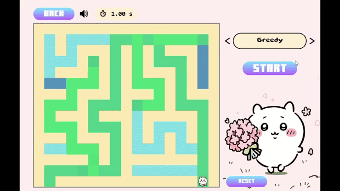

### 2.3. Nhóm thuật toán tìm kiếm có thông tin
#### a) Hill-Climbing Search
- **Mô tả**: 
    - Áp dụng thuật toán `Hill - climbing` vào bài toán mê cung ta có: nhân vật `A` tìm đường đi trong mê cung để thu thập toàn bộ kho báu `t`, tránh tường `*` và sau đó đến đích `B`.
    - **Ý tưởng:**
        - Khi đang ở một vị trí hiện tại, nhân vật A có thể di chuyển theo 4 hướng: lên, xuống, trái, phải.
        - Tính hàm `heuristic` cho mỗi ô lân cận (khoảng cách `Manhattan` tới mục tiêu) với điều kiện là các ô đó không ra ngoài mê cung và không phải là tường.
        - Chọn ô có giá trị `heuristic` nhỏ nhất, nếu nó tốt hơn thì chuyển đến đó.
        - Nếu không có ô nào tốt hơn thì dừng lại.
    - **Hai pha trong thuật toán: **
        - `Hill Climb` đơn pha: Tìm đường từ điểm hiện tại đến một mục tiêu cụ thể (`target`), thường là một kho báu hoặc đích.
        - `Hill Climb` đa pha: Sau khi tới một `target`, chọn `target` tiếp theo (kho báu khác hoặc đích `B`) và tiếp tục leo đồi.

- **Minh họa**:

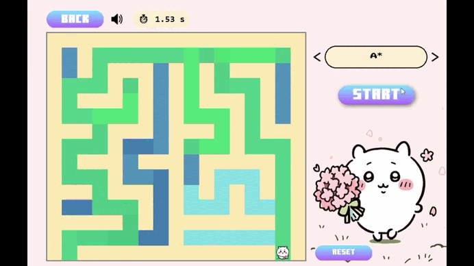

#### b) Simulated Annealing Algorithm
- **Mô tả**: Vì mê cung có thể có nhiều kho báu, nên thuật toán sử dụng phương pháp tạo sẵn đường đi và tìm nghiệm tốt nhất.

- **Minh họa**:

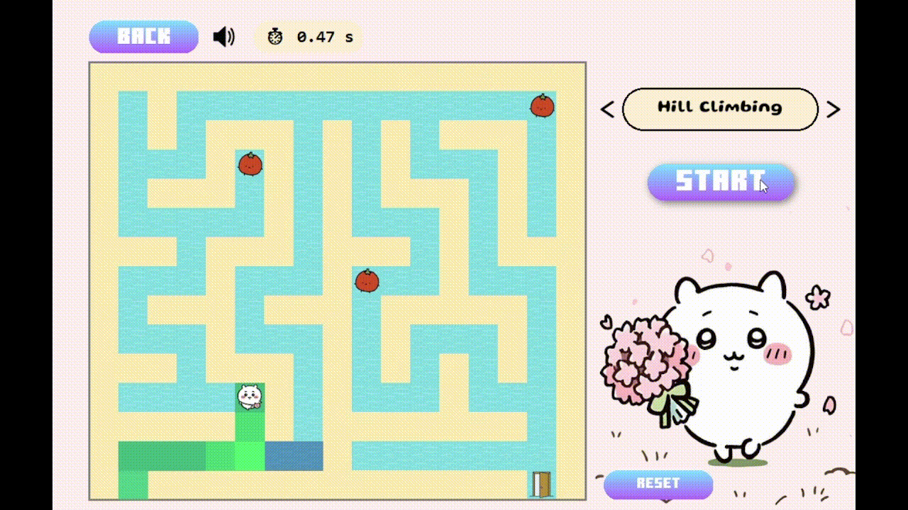

#### c) Beam Search Algorithm
- **Mô tả**: 
    - Áp dụng thuật toán Beam Search vào bài toán mê cung ta có: nhân vật A tìm đường đi trong mê cung để thu thập toàn bộ kho báu t, tránh tường `*` và sau đó đến đích B.
    - **Ý tưởng:**
        - Mỗi trạng thái của thuật toán gồm (vị trí hiện tại, tập kho báu đã nhặt).
        - Ở mỗi bước mở rộng, thuật toán sẽ:
            - Sinh ra các vị trí có thể đi tiếp (4 hướng: lên, xuống, trái, phải).
            - Tính hàm heuristic cho từng vị trí mới để ước lượng mức `tốt`.
            - K trạng thái có heuristic tốt nhất (xa mục tiêu nhất) sẽ được giữ lại.

- **Minh họa**:

### 2.4. Nhóm thuật toán tìm kiếm có thông tin
#### a) AND-OR tree search
- **Mô tả**: Ý tưởng của thuật toán AND-OR Tree Search là kết hợp việc phân chia các nhánh hành động và ràng buộc với điều kiện thu thập kho báu đủ số lượng kho báu:
    - **Node OR**: đại diện cho lựa chọn hướng đi tiếp theo từ vị trí hiện tại.
    - **Node AND**: đại diện cho các điều kiện cần thỏa mãn (như nhặt kho báu chưa lấy trước khi đến đích). Khi áp dụng vào mê cung: thuật toán bắt đầu từ start, với mỗi bước di chuyển hợp lệ mở rộng cây OR, đồng thời cập nhật số lượng kho báu đã thu thập. Chỉ khi tất cả kho báu đã được thu thập và đến đích, trạng thái mới được coi là goal (AND).

- **Minh họa**:

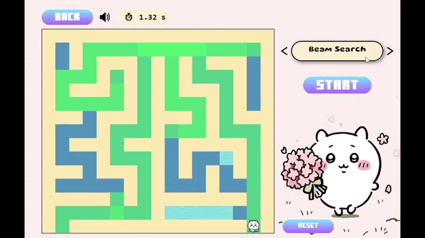

#### b) Belief-State Search
- **Mô tả**: Dựa trên tinh thần của thuật toán và dạng vấn đề mê cung, agent có thể bị mù mịt, không biết vị trí chính xác đang ở đâu, do đó agent khởi tạo trạng thái ban đầu gồm nhiều vị trí trong mê cung mà rất có thể rằng, agent tin có khả năng mình đang ở đó. Và từ các tọa độ vị trị trong trạng thái ban đầu, thuật toán sử dụng BFS để mở rộng ra toàn bộ mê cung và tìm được tập hợp các khả năng tìm được lời giải từ tập hợp các vị trí giả định ban đầu. 

- **Minh họa**:

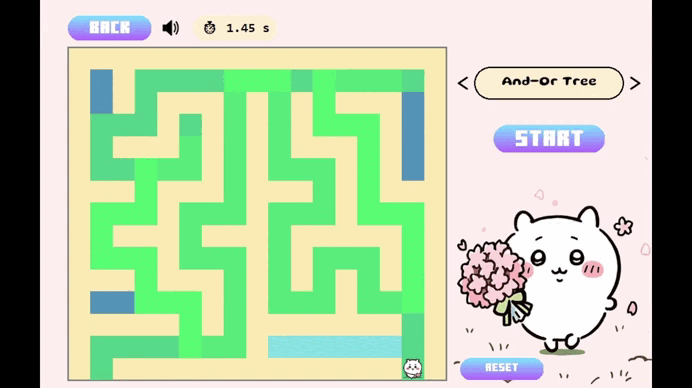

#### c) Partially Observable Search
- **Mô tả**: 
    - Dựa trên tinh thần của thuật toán là chỉ nhìn thấy một phần hướng đi đúng đắn của bài toán, mê cung bị che phủ hoàn toàn các bức tường, chỉ có ngẫu nhiên một vài kho báu được hiển thị như hướng chỉ dẫn cho agent di chuyển. 
    - Trong tình trạng mê cung bị che phù mờ mịt thế này và thuật toán đã biết vị trí của một số kho báu trong mê cung, sử dụng lại BFS để tìm đường đến kho báu gần nhất (hoặc đích nếu đã nhặt hết kho báu đã thấy) được cho biết trước trên mê cung bị che phủ (maze cover). Trong quá trình di chuyển đến kho báu (hoặc đích) gần nhất, thuật toán cũng phải sử dụng mê cung gốc để kiểm tra trạng thái của các hướng đi (như kiểm tra hướng đi đó có kho báu mới chưa được phát hiện hay không).

- **Minh họa**:

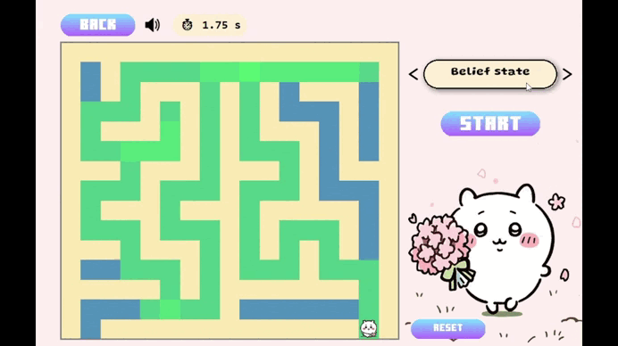

### 2.5. Nhóm thuật toán tìm kiếm có thông tin
#### a) Backtracking Search
- **Mô tả**: 
    - Áp dụng thuật toán Backtracking vào bài toán mê cung, mục tiêu là giúp nhân vật từ vị trí ban đầu A tìm đường đi ăn hết toàn bộ kho báu “t” rồi đến đích “B”.
    - Ý tưởng: 
        - Khi đang ở một vị trí hiện tại, nhân vật A có thể di chuyển theo 4 hướng: lên, xuống, trái, phải. Bỏ qua các ô tường “*” và ngoài biên. Nếu đi vào ô mới có kho báu, cập nhật mask. Tiếp tục gọi đề quy để đi sâu hơn.
        - Nếu đã đến được B và nhặt hết kho báu thì lưu lại đường đi ngắn nhất. Hoặc nếu đường hiện tại không thể tốt hơn lời giải đang có thì cắt tỉa (branch and bound).
        - Thuật toán sẽ quay lui về ô trước đó để thử hướng đi khác khi không còn hướng hợp lệ.
        - Trạng thái trong bài toán: (vị trí hiện tại, đường đi, mask_kho_báu).
        - h = khoảng cách Manhathan đến kho báu gần nhất hoặc `h = B + 2x(số kho báo còn lại)`. Nếu `độ dài đường đi hiện tại + h >= best_len` thì cắt bỏ nhánh đó.

- **Minh họa**:

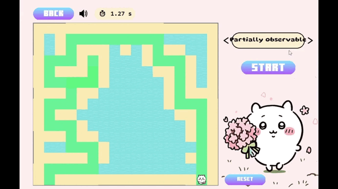

#### b) Forward-Checking Algorithm
- **Mô tả**: Khi áp dụng vào bài toán mê cung có nhiều kho báu, Forward Checking được kết hợp với DFS (Depth-First Search) như sau:
	- Mỗi bước đi của con rắn (hoặc tác nhân tìm đường) được xem là một biến trong CSP, giá trị là tọa độ kế tiếp.
	- Trước khi mở rộng đến một ô mới, thuật toán sẽ kiểm tra trước xem từ ô đó còn đường đi đến đích (hoặc kho báu tiếp theo) hay không. Nếu không còn đường đi khả thi, ô đó bị loại bỏ (pruning).
	- Khi có nhiều hướng đi, thuật toán ưu tiên những hướng có giá trị heuristic nhỏ nhất (gần đích hơn).
	- Sau khi tìm được một kho báu, nó đặt lại trạng thái mê cung và tiếp tục tìm đến kho báu tiếp theo, cho đến khi thu thập hết và đến được đích B.
Heuristic được sử dụng ở đây là khoảng cách Manhattan giữa hai điểm (a, b) nhằm ước lượng nhanh hướng đi gần đích nhất: `h(a,b)=∣a_x-b_x∣+∣a_y-b_y∣`
- **Minh họa**:

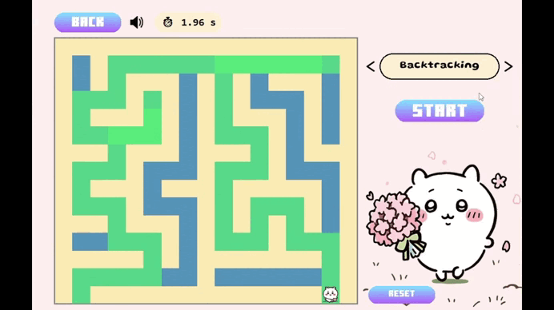

#### c) Arc Consistency 3 (AC-3)
- **Mô tả**: Ý tưởng chính là tận dụng tính nhất quán của cung (arc consistency) để loại bỏ các hướng đi không hợp lệ trước khi tìm kiếm. Thay vì kiểm tra ràng buộc trong quá trình duyệt BFS, thuật toán xây dựng trước domains (tập các ô kề có thể đi) cho mỗi ô trống. Khi thực hiện BFS, chỉ duyệt các ô trong domains, giúp giảm số trạng thái cần xét và tăng hiệu quả tìm kiếm. Với các bài toán như nhặt kho báu và đi đến đích, AC-3 giúp giảm bớt không gian tìm kiếm và tránh đi vào các ô vô nghĩa.
- **Minh họa**:

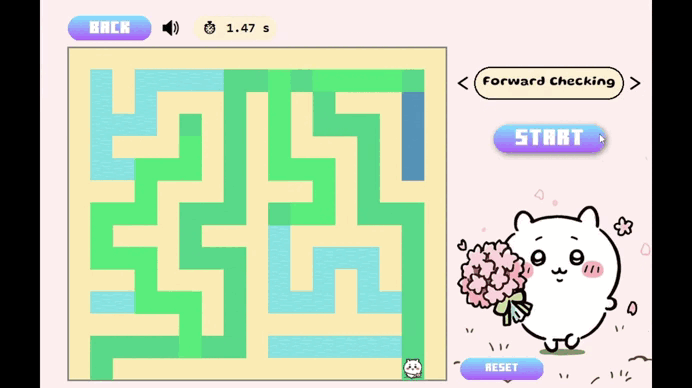